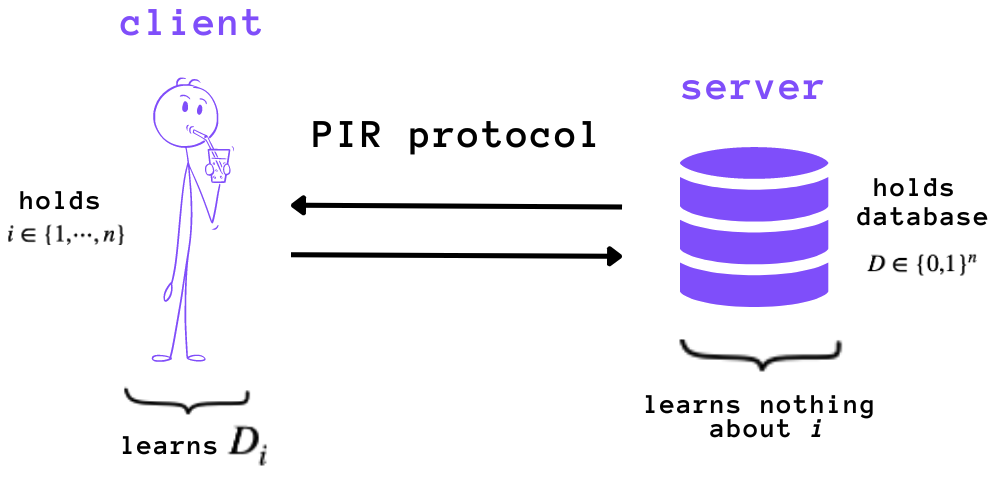

## Literature Review on Private Information Retrieval (PIR) and Cryptographic Primitives

<br>


This document reviews recent advances in **Private Information Retrieval** (a type of **Homomorphic Encryption**) in the context of **Story Protocol's privacy-enhanced hooks and modules**, with a brief discussion on **applications of zero-knowledge proof setups**.

<br>

This work is divided into the following:

* **I. Theoretical Background**: 
    - We briefly introduce a PIR protocol, its potential applications, and key concepts such as Homomorphic Encryption and Learning with Errors (LWE). This brief overview summarizes four general PIR sources cited at the end of this document.
<br>

* **II. Main Paper**: 
    - We utilize a creative approach to reproduce the strategy described in ["Simple and Fast Single-Server Private Information Retrieval", by Alexandra Henzinger et al. (2022)](https://eprint.iacr.org/2022/949). The concepts are explained with a coding setup suitable for software engineers without a background in cryptography.
<br>

* **III. Discussion in the Context of Story Protocol**:
    - We conclude with some of the current gaps in PIR technology and a high-level discussion on the design of cryptographic primitives (including zero-knowledge proofs) within the Story Protocol.


<br>

----

### I. Theoretical Introduction

<br>


#### What’s PIR

Private information retrieval refers to the **ability to query a database without revealing which item is looked up or whether it exists**, by using cryptographic primitives. [B. Chor et al.](https://www.wisdom.weizmann.ac.il/~oded/p_pir.html) first introduced the concept in 1995.

PIR schemes are generally divided into **single-server schemes** and **multiple-server schemes** (which allows you to remove the trust from a subset of the servers).

In this research, we will look at simple single-server PIR protocol setups, where a server holds an embedded database `D` represented by a `n x n` square matrix (whose elements are under a constant modulo), and a client wants to privately read the `ith` database item (`Di`, with `n` elements) without letting the server learn about `i`.

<br>

<p align="center">


<br>
<br>


<br>

#### Homomorphic Encryption Schemes

Suppose a server that can `XOR` client’s data. The client would send their cipher `c0`, obtained from their plaintext data `m0` and their key `k0`:

```
c = m0 ⌖ k0
```

**Homomorphism** is the property that if a client sends two encrypted messages, `c1` and `c2` (from messages `m0` and `m1`, respectively), the server can return `c1 ⌖ c2` so the client can retrieve `m0 ⌖ m1`.

**Additive homomorphism** occurs when, given two ciphertexts `(a0, c0)` and `(a1, c1)`, their sum `(a0 + a1, c0 + c1)` decrypts to the sum of the plaintexts (provided that the error remains sufficiently small).

**Partially homomorphic encryption** can be easily achieved as it accepts the possibility that not all data is encrypted (or homomorphic) through other operations (such as multiplication). 

**Fully homomorphic encryption (FWE)**, which is much harder to achieve, would occur if a server operated on encrypted data **without seeing ANY of its content.**

<br>

> 💡 *In a more formal definition, **homomorphic encryption** is a form of encryption with evaluation capability for computing over encrypted data without access to the secret key, i.e., supporting arbitrary computation on ciphers. **Fully homomorphic encryption** could be said to be the evaluation of arbitrary circuits of multiple types of (unbounded depth) gates (relevant to zero-knowledge proof setups).*

<br>

#### Learning with Errors (LWE)

PIR is also a subset of the broad topic of **lattice-based cryptography**. It refers to a series of **quantum-resistant cryptographic primitives** involving lattices, either in their construction or in the security proof.

> 💡 *Over an n-dimensional vector space, a lattice is an infinite set of points represented by a collection of vectors.*

In a [2005 seminal PIR paper](https://dl.acm.org/doi/10.1145/1060590.1060603), Oded Regev introduced the **first lattice-based public-key encryption scheme** and the **learning with errors (LWE) problem**. 

The LWE problem relies on the **hardness of distinguishing between a message with added noise and a random sample**. It can be thought of as **a search in a (noisy) modular set of equations whose solutions can be very difficult to solve**. In other words, given `m` samples of coefficients `(bi, ai)` in the linear equation `bi = <ai, s> + ei`, with the error `ei` sampled from a small range `[-bound, bound]`, finding the secret key `s` is "hard". 

Note, however, that LWE-based encryption schemes have a **significant drawback due to noise growth**. As the ciphertexts produced by these schemes are noisy encodings of the plaintext, **homomorphic operations between ciphertexts increase the magnitude of the noise**. If the noise exceeds a certain threshold, the correctness of the decryption may no longer hold. Despite this problem, **Regev encryption** can be very efficient for PIR as it is additively homomorphic.

In the past decades, Regev's security proof and the LWE scheme's efficiency have been the subject of intense research among cryptographers, including [Craig Gentry's thesis (2009)](https://crypto.stanford.edu/craig/craig-thesis.pdf), on the **first Fully Homomorphic Encryption Scheme**.


<br>

#### A Simple Implementation of the PIR Protocol

A PIR protocol aims to design **schemes that satisfy privacy and correctness constraints while achieving the minimum possible download cost**. 

<br>

> 💡 *The **download cost** of a PIR scheme is defined as **the total number of bits downloaded by the user from all the databases, normalized by the message size**. The **PIR rate** is defined as **the reciprocal of the PIR download cost**.*

<br>

One possible implementation approach is to choose a suitable polynomial and then have a single server preprocess the data. This preprocessing depends only on the database `D` and the public parameters of the Regev encryption scheme, so that the server can reuse the work across many queries from many independent clients.

After the preprocessing step, to answer a client's query, the server must compute only roughly `N 32-bit` integer multiplications and additions on a database of `N bytes`. The catch is that the client must download a *hint* matrix about the database contents after this preprocessing.

Therefore, a simple serve PIR scheme would comprise two phases:

* **the offline phase**, with pre-computations and the exchange of *hints*, and

* **the online phase**, with the query processing on the server and response decoding on the client.

The practicality of PIR-based applications is primarily impacted by the query processing time and the hint exchange phase. The theoretical query size grows as the square root of the number of field elements representing the database. For example, the largest query size for a database of `32 GB` is around `600 KB`.


<br>

#### Possible applications of PIR

Once PIR becomes less expensive or prohibitive (*i.e.*, cheaper computation with a small cipher, as PIR inherently has a high cost for server-side computation), these are some of the possible applications that could utilize the protocol:

- **Searching IP databases**: When filing a new IP, the author must search the IP database to check that no previous entry significantly overlaps with their invention. PIR could allow the search to be performed without leaving search terms on the query log of the IP database.

- **Real-time asset quotes**: Investors interested in a particular asset often monitor the market to determine when to purchase. PIR could allow their interest to be confidential.

- **Safe browsing and private oracles, checking passwords over breached databases (or any type of credentials), Certificate Transparency (CT) checks, certificate revocation checks,** among many others.


<br>


---

### II. ["Simple and Fast Single-Server Private Information Retrieval", by Alexandra Henzinger et. al (2022)](https://eprint.iacr.org/2022/949) 

<br>

#### Key Tenets

* This paper introduces a design for **SimplePIR**, **the fastest single-server PIR scheme known to date**.

* The security holds under a **Learning with Errors scheme** that requires no polynomial arithmetic or fast Fourier transforms. Regev encryption gives a secret-key encryption scheme that is secure under the LWE assumption.

* To answer a client’s query, the server performs fewer than **one 32-bit multiplication** and **one 32-bit addition** per **database byte**, achieving **10 GB/s/core server throughput**.

* The first approach to **query a 1 GB database** demands the client to first download a **121 MB "hint" about the database contents**. Then the client can make any number of queries, each requiring **242 KB of communication**.

* The second approach **shrinks the hint to 16 MB**. Then, following queries demands **345 KB of communication**.

* Finally, the scheme is applied, together with a novel data structure for approximate set membership, to the task of **private auditing in Certificate Transparency**. The results can be compared to Google Chrome’s current approach, with **16 MB of download per month, along with 150 bytes per TLS connection**.


<br>

#### A Server and a Query in SimplePIR

To illustrate the results above, I wrote a simple set of experiments in Python. This part is optional for the reader, and the full code is available at [./pir_experiment](pir_experiment).


In this code, the single-server database is represented by a square matrix `(m x m)`, while a query is a vector filled by `0s` except at the asking row and column `(m x 1)`. Any result should have the same dimension as the query vector (*i.e.*, the space is reduced to the size of the column where the data is located).

The server retrieves the queried item by:

1. looping over every column and multiplying their values to the value in the same row of the query vector, and

2. adding the values found in each column in its own matrix.


A secret key Regev encryption scheme using sampled errors to reproduce LWE is then built on top of the ideas above. Privacy is guaranteed by checking that fully homomorphic encryption is held with respect to addition in this setup (*i.e.*, additive homomorphism).


<br>

#### Part I: Defining a Message Vector Primitive


We start by defining a primitive class for the message vector and its operations:

```python
import os
import random

class Message:

    def __init__(self, mod=None, rows=None, cols=None, message=None):
        """Initialize a message vector"""

        self.mod = mod
        self.rows = rows
        self.cols = cols
        self.message = message

    ############################
    #      Private methods 
    ############################
    def _check_dimensions(self, other_msg) -> None:
        """Exit if the dimensions of two matrices are different"""

        if self.rows != other_msg.rows or self.cols != other_msg.cols:
            os.exit()

    def __add__(self, vector):
        """Add two matrices"""

        self._check_dimensions(vector)
        for i in range(len(self.message)):
            self.message[i] = (self.message[i] + vector.message[i]) % self.mod
        return self

    def __sub__(self, vector):
        """Subtract two matrices"""

        self._check_dimensions(vector)
        for index in range(len(self.message)):
            self.message[index] = (self.message[index] - vector.message[index]) % self.mod
        return self

    def __mul__(self, vector):
        """Multiply two matrices"""

        this_vector = [0] * (self.rows * vector.cols)
        for i in range(self.rows):
            for j in range(self.cols):
                for k in range(vector.cols):
                    this_vector[i * vector.cols + k] = (this_vector[i * vector.cols + k] +\
                        (self.message[i * self.cols + j] * vector.message[j * vector.cols + k])) % self.mod
        
        return Message(self.mod, self.rows, vector.cols, this_vector)
    
    def __eq__(self, vector):
        return (self.rows == vector.rows) and \
               (self.cols == vector.cols) and \
               (self.message == vector.message)

    def __repr__(self):
        return f'\nRows: {self.rows}\nCols: {self.cols}\nVector: {self.message}\n'

    ############################
    #     Public methods 
    ############################
    def calculate_scaling(self, numerator, denominator, this_mod):
        """Scale a message vector"""

        this_vector = [0] * (self.rows * self.cols)
        for i in range(len(self.message)):
            this_vector[i] = round((numerator * self.message[i]) / denominator) % this_mod
        return Message(this_mod, self.rows, self.cols, this_vector)

    def set_query_element(self, row, col, value) -> None:
        """Set the value at a particular index"""

        self.message[row * self.cols + col] = value
        
    def get_query_element(self, row, col) -> int:
        """Get the value at a particular index"""

        return self.message[row * self.cols + col]

    ############################
    #     Static methods 
    ############################
    @staticmethod
    def create_random_message(mod, rows, cols): 
        return Message(mod, rows, cols, [random.randint(0, mod - 1) for _ in range(rows * cols)])

    @staticmethod
    def create_zero_message(mod, rows, cols): 
        return Message(mod, rows, cols, [0 for _ in range(rows * cols)])

    @staticmethod
    def calculate_sample_error(bound, mod, rows, cols): 
        sample_error = random.randint(-bound, +bound)
        return Message(mod, rows, cols, [sample_error % mod for _ in range(cols * rows)])

```

<br>


#### Part II: Defining the Secret Key Regev Encryption Scheme

Encryption and decryption of a message can be defined as a simple secret key Regev encryption scheme:


```python
def encrypt(A, s, e, m0):
    """
        Encrypt this message with a simple `B = A * s + e + m0`, 
        where `s` is the secret and `e` is the error vector.
        Set the cipher as the tuple c = (B, A).
    """

    B = (A * s) + e + m0
    return (B, A)


def decrypt(s, c):
    """ 
        Calculate the decryption of a ciphertext, given c
        and a secret, such that m1 = m0 + e.
    """

    B = c[0]
    A = c[1]
    return B - (A * s)
```

<br>

These methods can be added to a primitive class that also sets the LWE parameters, such as the size of a message vector (`m` and `n`), the message's modulo `mod` and `p`, and a `bound` range (*e.g.,* the standard variation of a Gaussian distribution with zero `mean`).

<br>


```python
class Regev():

    def __init__(self):
        self.mod = None
        self.n = None
        self.m = None
        self.p = None
        self.bound = None
        self._load_env_parameters()

    ############################
    #      Private methods
    ############################
    def _load_env_parameters(self) -> None:
        """Load environment variables"""

        env_vars = load_config()
        self.mod = int(env_vars['mod'])
        self.n = int(env_vars['n'])
        self.m = int(env_vars['m'])
        self.p = int(env_vars['p'])
        self.bound = int(env_vars['bound'])

    ############################
    #      Public methods
    ############################
    def print_results(self, m0, m1, m0_string, m1_string) -> None:
        """Print the results of the experiment"""

        if m0 == m1:
            log_info(f'Original msg was successfully retrieved!\n')
        else:
            log_error(f'Original msg was not retrieved.')
        log_info(f'{m0_string}: {m0}\n')
        log_info(f'{m1_string}: {m1}\n')
        log_info(f'Parameters: \nmod: {self.mod} \nn: {self.n} \nm: {self.m} \np: {self.p} \nbound: [-{self.bound}, {self.bound}] \n')

    def print_noise_growth(self, m0, m1, noise_growth) -> None:
        """Print the noise growth"""

        log_info(f'Correct decryption for Delta / 2: {(self.mod / self.p) / 2}? {m0 == m1}')
        log_info(f'Noise growth: {noise_growth.message[0]}')

    def create_secret_key(self, this_mod=None, msg_n=1):
        """Create a secret key vector"""

        if this_mod is None:
            this_mod = self.mod
        return  Message.create_random_message(this_mod, self.n, msg_n)

    def create_message_setup(self, this_m=None, this_n=None, this_mod=None, msg_n=None):
        """Create a message vector setup"""
        
        if this_mod is None:
            this_mod = self.mod
        if this_m is None:
            this_m = self.m
        if this_n is None:
            this_n = self.n
        if msg_n is None:
            msg_n = 1

        # message vector of size `m`, where each element has a modulus `mod`
        m0= Message.create_random_message(this_mod, self.m, msg_n)

        # public    
        A = Message.create_random_message(self.mod, self.m, self.n)

        # error vector
        e = Message.calculate_sample_error(self.bound, self.mod, self.m, msg_n)

        return m0, A, e
```

<br>


#### Part III: Encryption and Decryption of a Message with a Sampled Error Vector

To illustrate how LWE can work, we operate our message vector over a ring modulo `mod`, so some information is lost. Then use Gaussian Elimination (a method to solve linear equations) to recover the original message.

First, we represent a message vector `m0` of size `m`, where each element has a modulo `mod`. 

Next, we encrypt this message with a simple `B = A * s + e + m0`, where `s` is the secret and `e` is an error vector.

Then, we set the ciphertext as the tuple `c = (B, A)` and decrypt `c = (B, A)` for a given `s`, such that `m1 = m0 + e`.


<br>

```python
def linear_secret_key_regev_encryption_with_error():
    """ 
        This method runs a secret key Regev encryption and decryption 
        experiment for a msg vector with a sampled error vector.

        In this simple example of learning with error (LWE), we operate
        our message vector over a ring modulo mod, such that some
        information is lost. This is not a problem since Gaussian elimination
        can be used to recover the original message vector (i.e., it works
        over a ring modulo mod).

        We represent the message vector m0 of size m where each element is
        modulus mod. The cipertext c is B = A * s + e + m0, which can be
        decrypted as c = (B, A).
    """

    ########################################################################
    # 1. Key generation
    ########################################################################
    regev = Regev()
    m0, A, e = regev.create_message_setup()
    s = regev.create_secret_key()

    ########################################################################
    # 2. Encryption by calculating B and ciphertext c
    ########################################################################
    c = regev.calculate_encryption(A, s, e, m0)

    ########################################################################
    # 3. Calculate the decryption of the ciphertext c
    ########################################################################
    m1 = regev.calculate_decryption(s, c)

    ########################################################################
    # 4. The message vector m1 should be equal to m0 plus the error vector e
    ########################################################################
    regev.print_results(m0, m0 + e, 'm0', 'm0 + e')
```

<br>

The original message should be retrieved.

<br>

#### Part IV: Running a Simple Linear Key RRgev Encryption Experiment with a Scaled Message


Continuing with Learning with Errors (LWE), we now lose information on the least significant bits by adding noise, *i.e.*, by scaling the message vector (before adding it to encryption) with:

```
delta = mod / p
```

Then, during the decryption, we scale the message vector back by:

```
1 / delta
```

The scaling ensures that `m` is in the highest bits of the message vector, without losing information by adding the error vector `e`.

Consequently, the message `m0` vector has each element modulo `p` (not `mod`), where `p < q`. The scaled message is:

```
m0_scaled = m0 * delta = m0 * mod / p
```

The ciphertext `c` is:

```
B = A * s + e + m0_scaled
```

which can be decrypted as

```
c = (B, A)
```

This is the code:

```python
def linear_secret_key_regev_encryption_scaled():
    """ 
        This method runs a secret key Regev encryption and decryption experiment
        for a msg vector with a scaled msg vector.

        In this another simple example of learning with errors (LWE), we lose
        information on the least significant bits by adding noise, i.e., by scaling 
        the message vector by delta = mod / p before adding it to encryption. 
        Then, during the decryption, we scale the message vector by 1 / delta.

        The scaling ensures that m is in the highest bits of the message vector,
        without losing information with the addition of the error vector e.

        Now, the message m0 vector has each element module p (not mod), where
        p < q. The scaled message is now m0_scaled = m0 * delta = m0 * mod / p.
        The cipertext c is B = A * s + e + m0_scaled, which can be decrypted as
        c = (B, A), i.e., m0 = (B - A * s) / delta = (delta * m0 + e) / delta.
    """

    ########################################################################
    # 1. Key generation
    ########################################################################
    regev = Regev()
    m0, A, e = regev.create_message_setup(this_mod = regev.p)
    s = regev.create_secret_key()

    ########################################################################
    # 2. Scale message vector by delta = mod / p
    ########################################################################
    scaled_m0 = m0.calculate_scaling(regev.mod, regev.p, regev.mod)

    ########################################################################
    # 3. Encryption by calculating B and ciphertext c
    ########################################################################
    c = regev.calculate_encryption(A, s, e, scaled_m0)

    ########################################################################
    # 4. Calculate the decryption of the ciphertext c
    ########################################################################
    m1 = regev.calculate_decryption(s, c)

    ########################################################################
    # 5. Scale m1 vector by 1/ delta = p / mod
    ########################################################################
    scaled_m1 = m1.calculate_scaling(regev.p, regev.mod, regev.p)

    ########################################################################
    # 6. The message vector m0 should be equal to m1
    ########################################################################
    regev.print_results(m0, scaled_m1, 'm0', 'scaled m1')
```

<br>

The original message should be retrieved.


<br>

#### Part V: Proving that the Regev Scheme is Additive Homomorphic

As we saw above, additive homomorphism means that if `c0` is the encryption of `m1` under a secret key `s`, and `c2` is the encryption of `m2` under the same secret key `s`, then `c0 + c1` is the encryption of `m0 + m1` under `s`.

For a large number of `ci`, noise can be introduced from error, so the correctness of the results will depend on the values of `m`, `n`, `mod`, and `p`, such that:

```
|sum ei| < mod / (2 * p)
```

Here is the source code for this experiment:

<br>

```python
def additive_homomorphism() -> None:
    """ 
        This method proves that the secret key Regev encryption scheme is
        additive homomorphic, i.e., if c0 encrypts m0 and c1 encrypts m1,
        both under s, then c0 + c1 decrypts to m0 + m1. 
    """

    ########################################################################
    # 1. Key generation for two independent messages m0 and m1
    ########################################################################
    r0 = Regev()
    m0, A0, e0 = r0.create_message_setup(this_mod = r0.p)

    r1 = Regev()
    m1, A1, e1 = r1.create_message_setup(this_mod = r1.p)

    s = r0.create_secret_key()

    ########################################################################
    # 3. Scale message vectors by delta = mod / p
    ########################################################################
    scaled_m0 = m0.calculate_scaling(r0.mod, r0.p, r0.mod)
    scaled_m1 = m1.calculate_scaling(r1.mod, r1.p, r1.mod)

    ########################################################################
    # 4. Encryption by calculating B and ciphertext c for each message
    ########################################################################
    c0 = r0.calculate_encryption(A0, s, e0, scaled_m0)
    c1 = r1.calculate_encryption(A1, s, e1, scaled_m1)

    ########################################################################
    # 5. Add the ciphertexts, with c2 = c0 + c1
    ########################################################################
    c2 = (c0[0] + c1[0], c0[1] + c1[1])

    ########################################################################
    # 6. Decrypt the sum of the ciphertexts
    ########################################################################
    r2 = Regev()
    m2 = r2.calculate_decryption(s, c2)

    ########################################################################
    # 5. Scale m1 vector by 1/ delta = p / mod
    ########################################################################
    scaled_m2 = m2.calculate_scaling(r2.p, r2.mod, r2.p)

    ########################################################################
    # 6. The sum of the message vectors m0 and m1 should be equal to m2
    ########################################################################
    r2.print_results(m0 + m1, scaled_m2, 'm0 + m1', 'm2')
```

<br>

The original message should be retrieved.

<br>


#### Part VI: Proving that the Regev Scheme Supports Plaintext Inner Product

This experiment shows that given a cipher `c` and a message vector `m0`, `c -> c1` can be transformed such that it also encrypts the inner product of `m0` with a plaintext vector `k` of size `m` and element modulo `p`.

Because of noise growth with the vector `k`, fine-tuning the initial parameters is crucial for the message to be successfully retrieved. As you will see in the snippet below, to guarantee correct decryption, the following must hold:

```
k * e0 < mod / (2 * p)
```

Here is the source code:

<br>

```python


def plaintext_inner_product():
    """ 
        This method proves that the secret key regev encryption scheme is
        supports plaintext inner product, i.e., if c0 encrypts m0 and c1
        encrypts m1, both under s, then c0 * c1 decrypts to m0 * m1.
    """

    ########################################################################
    # 1. Key generation
    ########################################################################
    r0 = Regev()
    m0, A, e = r0.create_message_setup(this_mod = r0.p)
    s = r0.create_secret_key(this_mod = r0.p)

    ########################################################################
    # 2. Scale message vector by delta = mod / p
    ########################################################################
    scaled_m0 = m0.calculate_scaling(r0.mod, r0.p, r0.mod)

    ########################################################################
    # 3. Encryption by calculating B and ciphertext c
    ########################################################################
    c = r0.calculate_encryption(A, s, e, scaled_m0)

    ########################################################################
    # 4. Calculate a plaintext vector transposed k and then scale it by
    #    delta = mod / p
    ########################################################################
    rk = Regev()
    k = m0.create_random_message(rk.p, 1, rk.m )
    scaled_k = m0.calculate_scaling(1, 1, rk.mod)

    ########################################################################
    # 5. Calculate the noise growth 
    ########################################################################
    noise_growth = scaled_k * e

    ########################################################################
    # 6. Define the ciphertext of the inner product of m0 and k
    ########################################################################
    c1 = (scaled_k * c[0], scaled_k * c[1])

    ########################################################################
    # 7. Decrypt the ciphertext of the inner product of m0 and k
    ########################################################################
    m1 = r0.calculate_decryption(s, c1)

    ########################################################################
    # 8. Scale m1 vector by 1/ delta = p / mod
    ########################################################################
    m1_scaled = m1.calculate_scaling(r0.p, r0.mod, r0.p)

    ########################################################################
    # 9. Scale back the plaintext vector k by 1/ delta = p / mod
    ########################################################################
    scaled_scaled_k = scaled_k.calculate_scaling(1, 1, rk.p)

    ########################################################################
    # 10. The message vector m1 scaled should be equal scaled k * m0
    ########################################################################
    r0.print_results(m1_scaled, scaled_scaled_k * m0, 'scaled m1', 'scaled k * m0')

    ########################################################################
    # 11. Print results on noise, decryption fails when noise > delta / 2 
    ########################################################################
    rk.print_noise_growth(m1_scaled, scaled_scaled_k * m0, noise_growth)
```


<br>

The original message should be retrieved.

<br>

#### Part VII: Running a Very Simple PIR Setup Without Encryption

We are ready to see how PIR works (without encryption yet).

We define our server's database by a square vector of size `m x m`, with each entry modulo `p`. Then, we query a value at a specific row `r` and col `c` in plaintext, by creating a query vector of size `m x 1` that is filled with `0`, except for the desired column index `c`.

We then show that computing the dot product of the database vector to the query vector will give a result vector with all rows in the column index `c`, from which you can retrieve row `r`.

<br>


```python
def no_encryption_example():
    """
        Run a tutorial presenting the logic of a PIR experiment 
        without encryption.
    """

    ########################################################################
    # 1. Represent a database as a square matrix, where the columns are 
    #    the database entries and the rows are the database attributes
    ########################################################################
    log_debug('In this PIR tutorial, we represent a database as a square matrix, ' + 
        'where columns are the database entries and rows are the database attributes.')
    
    log_debug('We intantiate the class Message(), creating a random database ' +
                                  'with mod 500, and 20 entries and 20 attributes.\n')

    msg = Message()
    db = msg.create_random_message(500, 20, 20)
    
    log_debug(f'db: {db}\n')

    ########################################################################
    # 2. Create some random query value for row and column
    ########################################################################
    log_debug('Now, let\'s create a random query value for row and column. ' +
                                            'Say, row 10 and column 10.')
    
    query_row = 10
    query_col = 10

    log_debug(f'query_row: {query_row}, query_col: {query_col}\n')

    ########################################################################
    # 3. Create a message that is 5 at the query column and 0 elsewhere
    ########################################################################
    log_debug('Let\'s create a query message vector, of size 500, that is 1 at ' +
                                            'the query column and 0 elsewhere.')
    query = msg.create_zero_message(500, 20, 1)
    query.set_query_element(query_col, 0, 1)

    log_debug(f'query vector: {query.message}')

    ########################################################################
    # 4. Compute resulting message vector
    ########################################################################
    log_debug('Let\'s compute the resulting message vector, which is the ' +
                               'dot product of the database and the query.')
    
    result = db * query
    log_debug(f'result = db * query: {result}\n')

    ########################################################################
    # 5. Compute msg retrieved from the database
    ########################################################################
    log_debug('Finally, let\'s compute the message retrieved from the database, ' + 
                    'by getting the element at the query row and column.')
    log_debug(f'db.get_query_element({query_row}, {query_col}): {db.get_query_element(query_row, query_col)}\n')

    log_debug('This should be the same as the result message vector element at the query row.')
    log_debug(f'result.get_query_element({query_row}, 0): {result.get_query_element(query_row, 0)}\n')

    correct_retrieval = result.get_query_element(query_row, 0) == \
                        db.get_query_element(query_row, query_col)

    log_info(f'Are they the same? Did we get a correct retrieval? {correct_retrieval}')
```

<br>

The original message should be retrieved.

<br>

#### Part VIII: Running a Full Secret Key Regev PIR Experiment

Finally, we achieve a full PIR experiment by building a query vector as in the previous experiment, but now encrypting it using the secret key `s` from the Regev encryption scheme.

```python
def secret_key_regev_example():

    """Run a secret key regev encryption and decryption PIR experiment."""
    ########################################################################
    # 1. Represent a database as a square matrix, where the columns are 
    #    the database entries and the rows are the database attributes
    ########################################################################
    regev = Regev()
    msg = Message()

    log_debug('1. We start creating a random message vector ' + 
                                 'as a square m x m database with mod p')
    
    db = msg.create_random_message(regev.p, regev.m, regev.m)
    log_debug(f'db: {db}\n')

    ########################################################################
    # 2. Create some random query value for row and column
    ########################################################################
    log_debug('2. Now, let\'s create a random query value for row and column.')
    query_row = 5
    query_col = 5

    log_debug(f'query_row: {query_row}, query_col: {query_col}\n')

    ########################################################################
    # 3. Create query message vector
    ########################################################################
    log_debug('3. Let\'s create a query message vector, of size m, that is 1 at ' +
                                            'the query column and 0 elsewhere.')                

    query = msg.create_zero_message(regev.mod, regev.m, 1)
    query.set_query_element(query_col, 0, 1)

    log_debug(f'query vector: {query.message}\n')

    ########################################################################
    # 4. Encrypt query message vector
    ########################################################################
    log_debug('4. Let\'s encrypt the query message vector, calculating A and e.')
   
    _, A, e = regev.create_message_setup()

    # Here we could either use mod or p as the scaling factor.
    s = regev.create_secret_key()

    log_debug(f'The secret key s: {s}')

    ########################################################################
    # 5. Scale query vector by delta = mod / p and db vector from p to mod
    ########################################################################
    log_debug('5. We scale the query vector by delta=mod/p and db vector to 1/p')

    scaled_query = query.calculate_scaling(regev.mod, regev.p, regev.mod)
    scaled_db = db.calculate_scaling(1, 1, regev.mod)

    log_debug(f'scaled_query: {scaled_query}')
    log_debug(f'scaled_db: {scaled_db}\n')

    ########################################################################
    # 6. Encryption by calculating B and ciphertext c
    ########################################################################
    log_debug('6. Let\'s encrypt the query vector by calculating B and ciphertext c.')
    c_query = regev.calculate_encryption(A, s, e, scaled_query)

    log_debug(f'c_query: {c_query}\n')

    ########################################################################
    # 7. Compute encrypted result
    ########################################################################
    log_debug('7. Let\'s compute the encrypted result by calculating the dot ' +
                 'product of the encrypted query and the encrypted database.') 

    c_result = (scaled_db * c_query[0], scaled_db * c_query[1])

    log_debug(f'c_result: {c_result}\n')

    ########################################################################
    # 8. Calculate the decryption of the ciphertext c_result to find the
    #    result of the PIR query at the query_col th column
    ########################################################################
    log_debug('8. Let\'s calculate the decryption of the ciphertext c_result')                 
    m1 = regev.calculate_decryption(s, c_result)

    log_debug(f'm1: {m1}\n') 

    ########################################################################
    # 9. Scale the result by p / mod
    ########################################################################
    log_debug('9. Let\'s scale the result by p / mod.')
    m1_scaled = m1.calculate_scaling(regev.p, regev.mod, regev.p)

    log_debug(f'm1_scaled: {m1_scaled}\n')

    ########################################################################    
    # 10. The message vector m1_scaled should be equal to the db at the 
    # query vector query_row, query_col, showing that PIR works.
    ########################################################################
    log_debug('10. The message vector m1_scaled should be equal to the db at ' +
               'the query vector query_row, query_col, showing that PIR works.')  

    log_debug(f'db.get_query_element({query_row}, {query_col}): {db.get_query_element(query_row, query_col)}') 
    log_debug(f'm1_scaled.get_query_element({query_row}, 0): {m1_scaled.get_query_element(query_row, 0)}\n')            

    correct_retrieval = m1_scaled.get_query_element(query_row, 0) == \
                        scaled_db.get_query_element(query_row, query_col)

    log_info(f'Are they the same? Did we get a correct retrieval? {correct_retrieval}\n')
```


<br>

The original message should be retrieved.

<br>


---

### IV. Discussion

<br>

#### Why PIR is Still Not Feasible


Although modern PIR schemes require surprisingly little communication and the protocol works well enough at smaller scales, the time needed to scan it grows proportionally as the database grows. For bigger databases, the process becomes prohibitively inefficient (fetching a database record grows only polylogarithmically with the number of records,`N`).

After preprocessing the database, the server can answer a query in time sublinear in N. Thus, the current hard limit on the throughput of PIR schemes is the ratio between the database size and the server time to answer a query (the speed with which the PIR server can read the database from memory).


<br>

#### PIR for Private IP Search

If PIR protocols become fully available for commercial applications, Story Protocol could take advantage of this technology to implement private oracles, including private IP search and discovery.

Although it's still early to define how this protocol could be incorporated into Story's modular architecture, we discuss an idea here.

[Story Protocol's documentation](https://docs.storyprotocol.xyz/docs/) defines the **Function Layer (verbs)** separated from the **Data Layer (nouns)** and divided into two types of components:
- **Modules**, defining the actions that users can perform on the IP assets (IPAs), *i.e,.* the management of the data. 
- **Hooks**, defining the add-on features based on the actions provided by modules. 

In this design, PIR could be introduced as follow:

1. An off-chain pre-processing server as part of the core data.
2. A new private Module that would be responsible for connecting to this pre-formatted data.
3. Hooks that would talk to the private Module. For instance, a hook that can submit PIR-formatted encrypted messages from a private oracle search or a private infringement detection request.
4. Application layers performing queries (client side)


Finally, it's important to note that PIR protocols do not ensure data integrity or authentication. An authenticated PIR scheme could combine an unauthenticated multi-server PIR scheme with a standard integrity-protection mechanism, such as Merkle trees.

In this approach, PIR servers download the data from the blockchain to construct PIR databases. For each database, the PIR server create a description file (usually called a *manifest file*). The user collect all available block headers and fetches the manifest files from the PIR servers to later efficiently query the PIR database.

<br>

<p align="center">


<br>
<br>


#### Zero Knowledge Proofs for Other Privacy-Enhanced Operations

In the Story Protocol documentation, there is a hint at the applicability of ZKPs and cryptographic setups when [speaking of AI-generated Assets marketplaces](https://docs.storyprotocol.xyz/docs/ai-generated-assets-marketplace).

> *"Use ZKP or simple hash of prompt to validate that the marketplace is running infringement checks without revealing prompts".*

<br>

Therefore, we conclude this work by briefly touching further privacy enhancements through a zero-knowledge protocol, which is designed to verify the truth of information without revealing the information itself. In other words, a verifier can convince themselves that a prover possesses knowledge of a secret parameter (called a witness) satisfying some relation, without revealing the witness to the verifier or anyone else.


<br>

> 💡 ZKPs come to the forefront as one of three possible solutions to ensure the privacy of the information exchanged on the blockchain. The other ones are secure multi-party computations (sMPC) and trusted execution environments (TEE).


<br>

For instance, the popular ZK-SNARK setup could generally be implemented by:

* An off-chain key generator and ceremony, for enough entropy.
* An on-chain setup to construct and determine the initial state of the prover and verifier (using a combination of public and private keys or a common reference string).
* At the Function layer, privacy protection hooks could be leveraged to protect IP rights and to allow content encryption, digest registration, private governance, private compliance, private payment, private token gating, duplicated IP detection, and PI protection.
At the application layer (ecosystem), some examples are KYC verification for license issuers and holders and even a decentralized identity for IP holders.


<br>

Current downsides of this technology are:

* Computation intensity: algorithms used are computationally intense as they require many interactions between the verifier and the prover (in interactive ZKPs), or require a lot of computational capabilities (in non-interactive ZKPs).

* Design ZkEVM challenge: zkEVM that is fully compatible with native EVM is difficult to build.

* Security: to satisfy the three properties of ZKP (Completeness, Soundness, and Zero-knowledge), it is necessary to check that there are no security vulnerabilities in circuit configuration, library use, and key management (such as weak generated encryption keys, storing encryption keys in an insecure manner, or using the same key for multiple purposes).


<br>

---

### References


* [[1] Private Information Retrieval and Its Applications, Sajani Vithana et al.](https://arxiv.org/pdf/2304.14397.pdf)
* [[2] Practical Private Information Retrieval, Femi George Olumofin](https://uwspace.uwaterloo.ca/bitstream/handle/10012/6142/Olumofin_Femi.pdf?sequence=1&isAllowed=y)
* [[3] How Practical is Single-Server Private Information Retrieval?, Sophia Artioli](https://ethz.ch/content/dam/ethz/special-interest/infk/inst-infsec/appliedcrypto/education/theses/How_practical_is_single_server_private_information_retrieval_corrected.pdf)
* [[4] Applying Private Information Retrieval to Lightweight Bitcoin Clients, Kaihua Qin et al.](https://www.computer.org/csdl/proceedings-article/cvcbt/2019/366900a060/1cdOwKCMqXK)


