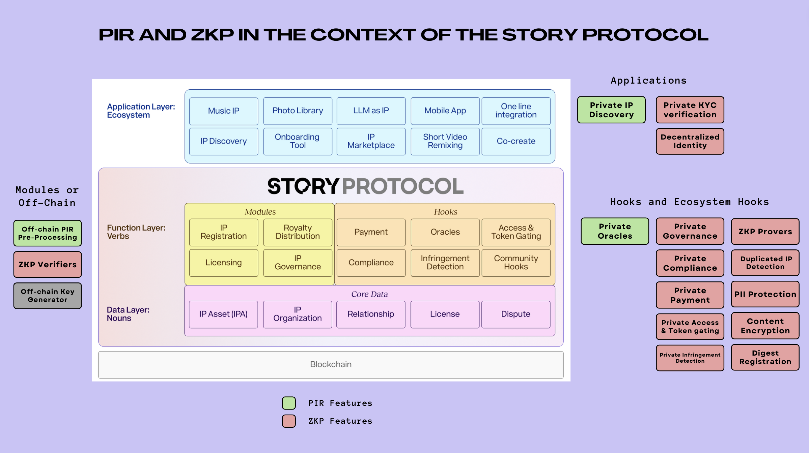

## Literature Review on Private Information Retrieval (PIR)

<br>


We review recent advances on **Private Information Retrieval** (a type of **Homomorphic Encryption**) in the context of **Story Protocol's privacy-enhanced hooks and modules**, while briefly discussing **general applications of zero-knowledge proof setups**.


<br>

----

### I. Introduction

<br>


#### What’s PIR

Private information retrieval refers to the **ability to query a database without revealing which item is looked up or whether it exists**, by using cryptography and zero-knowledge proof primitives. The concept was first introduced in 1995 by [B. Chor et al](https://www.wisdom.weizmann.ac.il/~oded/p_pir.html).


In a very simplified version of PIR on a matrix setup, **a client wants to retrieve the ith element `D_i` of a server database `D` (and `n` elements `D_i`), without letting the server know which element is being requested**:

<br>

<p align="center">


<br>
<br>

#### Fully Homomorphic Encryption Schemes

To understand homomorphism, think of an example of a server that can `XOR` a client’s data. The client could send their cipher `c0`, obtained from their plaintext data `m0` and their key `k0`:

```
c = m0 ⌖ k0
```

Homomorphism comes from the fact that if a client sends two encrypted messages, `c1` and `c2` (from messages `m0` and `m1`, respectively), the server can return `c1 ⌖ c2` so that the client can then retrieve `m0 ⌖ m1`.

Partially homomorphic encryption is easily achieved as it can accept the possibility of not all the data being encrypted (or homomorphic) through other operations (such as multiplication). **Fully homomorphic encryption (FWE)** is achieved when a server operates on encrypted data **without seeing ANY content of the data**.

<br>

> 💡 *In a more formal definition, homomorphic encryption is a form of encryption with evaluation capability for computing over encrypted data without access to the secret key, i.e., it supports arbitrary computation on ciphers. fully homomorphic encryption is the evaluation of arbitrary circuits of multiple types of (unbounded depth) gates.*

<br>

In a [seminal paper in 2005](https://dl.acm.org/doi/10.1145/1060590.1060603), Oded Regev introduced the **first lattice-based public-key encryption scheme**, and the **learning with errors (LWE) problem**. 

The LWE problem can be thought of as a search in a (noisy) modular set of equations whose solutions can be very difficult to solve. In other words, given `m` samples of coefficients `(bi, ai)` in the linear equation `bi = <ai, s> + ei`, with the error `ei` sampled from a small range `[-bound, bound]`, the problem of finding the secret key `s` is hard.

In the last years, research has been done to improve Regev's security proof and the efficiency of the scheme, including [Craig Gentry's 2009 first fully homomorphic encryption scheme](https://crypto.stanford.edu/craig/craig-thesis.pdf).


<br>

#### Possible applications of PIR

Possible applications that could use a PIR protocol once it becomes less expensive or prohibitive (*i.e.*, cheap computation with a small cipher, as PIR inherently has a high cost for server-side computation) are among:
- law enforcement
- safe browsing
- health providers
- stock exchanges

<br>


#### In the Context of Story Protocol

According to [Story Protocol's documentation](https://docs.storyprotocol.xyz/docs/), the **Function Layer (verbs)** is separated from the **Data Layer (nouns)** and divided into two types of components 
- **Modules**, defining the actions that users can perform on the IP assets (IPAs), *i.e.* the management of the data. This would be the "database side" in a PIR setup.
- **Hooks**, defining the add-on features based on the actions provided by modules. This would be the "client side" in a PIR setup. 

Suppose, we have a hook to submit PIR-formatted encrypted messages for a private oracle search or a private infringement detection request.

The **Registration Module** could support a private setup with functions for searching for IP assets. Users can also set metadata and add IP asset types by interacting with the module.

Relationship Module: It implements the process of creating relationships with parameter validation and permission check. It also offers the functions for getting relationship definition from relationship ID and vice versa.
Licensing Module: It implements the licensing functions for IP Orgs, which includes configuring licensing framework for an IP Org, get the licensing config for an IP Org, set and get the non-commercial licenses across Story Protocol.


<br>

<p align="center">


<br>


There is a hint on the applicability of ZKPs and cryptographic setups when [speaking of AI-generated Assets market places](https://docs.storyprotocol.xyz/docs/ai-generated-assets-marketplace):

> "Use ZKP or simple hash of prompt to validate that the marketplace is running infringement checks without revealing prompts"

- Searching IP databases: The filing process of a new intelectual property necessarily requires the author to search the patent database to establish that no previous patent has a significant overlap with their invention. They would like to perform the search in a manner that does not leave search terms on the query log of the patent database. 

- Private oracles:

- Compliance

- Real-time asset quotes: An investor interested in a particular asset would often need
to monitor the market to know when to make a purchase decision. The investor might prefer a monitoring means that keeps their interest confidential.

- Infrigement detection


In the context of the Story Protocol, infrigement detection and privacy protection hooks should be leveraged to protect IP rights and to allow content encryption, digest registration, and anonymous searching.

For instance, once PIR technology becomes feasible, it could be applied to validate that a marketplace is running infringement checks without revealing prompts.

To illustrate these assumptions, in the next sessions we review recent advances on PIR through an engineer (builder) language.

<br>

---

### II. "[One Server for the Price of Two: Simple and Fast Single-Server Private Information Retrieval", by Alexandra Henzinger et. al (2022)](https://eprint.iacr.org/2022/949) 

<br>

#### TL; DR

* This paper introduces the design of *the fastest single-server pir scheme known to date*. 
* The scheme's security holds under the learning-with-errors (LWE) assumption, where to answer a client’s query, the server performs fewer than one 32-bit multiplication and one 32-bit addition per database byte, achieving 10 GB/s/core server throughput, which approaches the memory bandwidth of the machine
* The first scheme has relatively large communication costs: to make queries to a 1 GB database, the client must download a 121 MB "hint" about the database contents; thereafter, the client may make an unbounded number of queries, each requiring 242 KB of communication. 
* The second single-server scheme shrinks the hint to 16 MB at the cost of slightly higher per-query communication (345 KB) and slightly lower throughput (7.4 GB/s/core). 
* The schemes are applied, together with a novel data structure for approximate set membership, to the task of private auditing in Certificate Transparency, achieving a strictly stronger notion of privacy than Google Chrome’s current approach with modest communication overheads: 16 MB of download per month, along with 150 bytes per TLS connection.

#### A Simple Single-Server Scheme as an Intuitive Illustration of How PIR Works

PIR schemes are generally divided into **single-server schemes** and **multiple-server schemes** (when you remove the trust of a subset of the servers). For this illustration, we will work with a vanilla setup for a simple single server, where **the “database” is represented by a square matrix whose elements are under a constant modulo**.

In the simplest setup, we have a server that holds an embedded database, and we have a client that holds an index `i` between `1` and `n`. The client wants to privately read the `ith` database item by interacting with a server following a PIR protocol, *i.e.*, without letting the server learn anything about the index i that the client is reading.


<br>

---

### III. Paper 2:

#### tl; dr


<br>


----

### IV. Closing Remarks

<br>

#### Gaps and Improvements


<br>

#### Impact to Story Protocol


