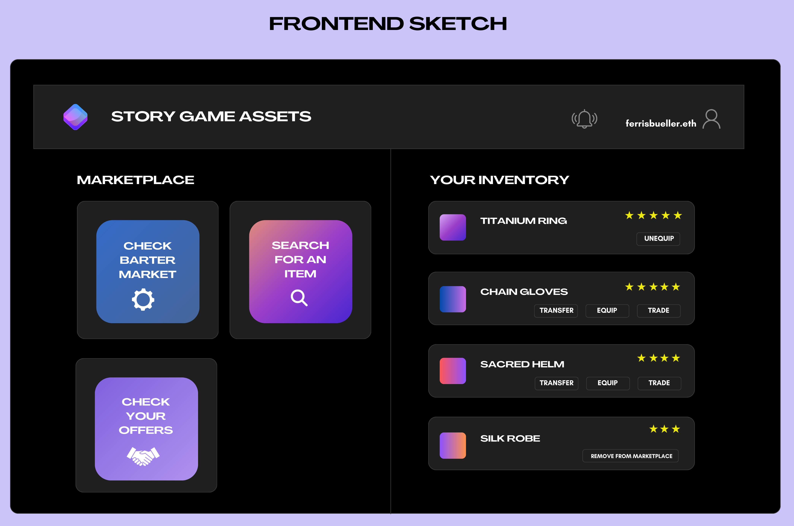
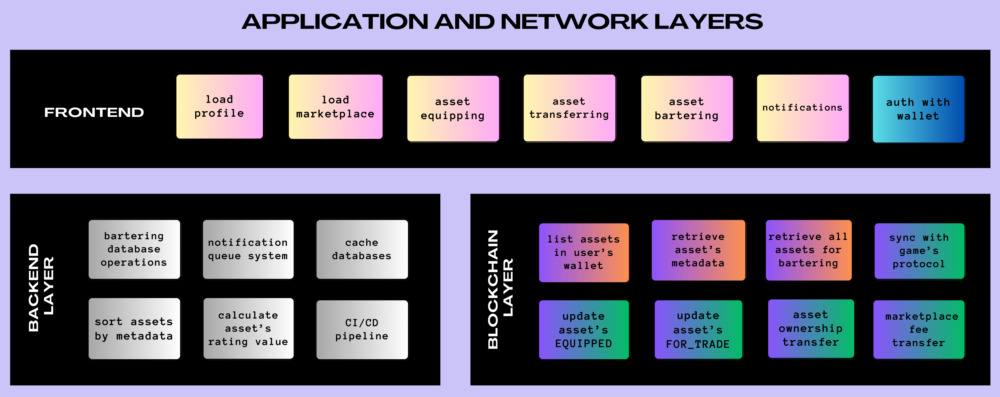
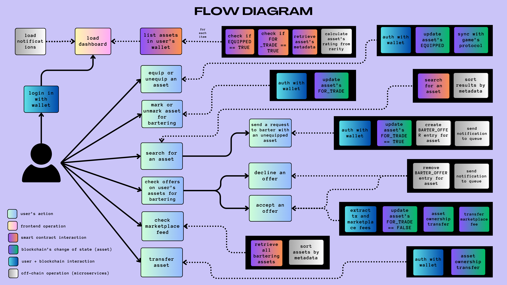
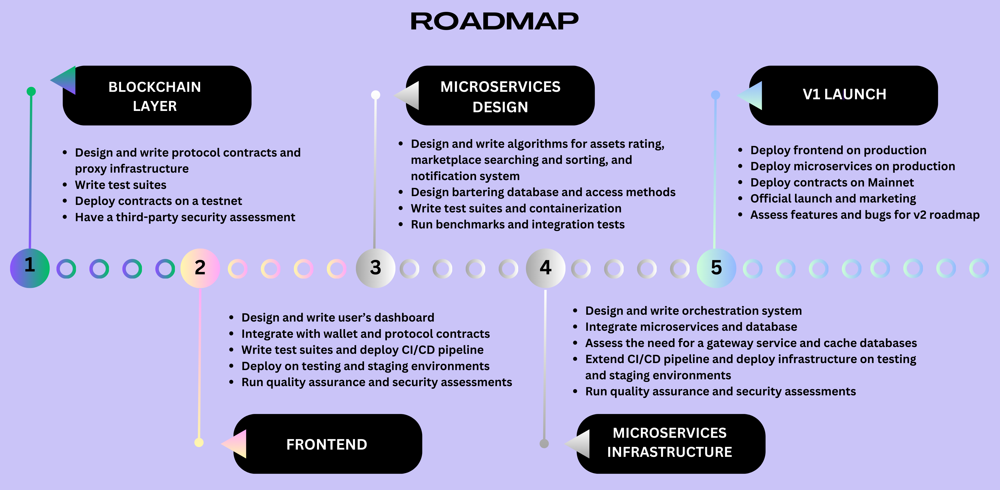
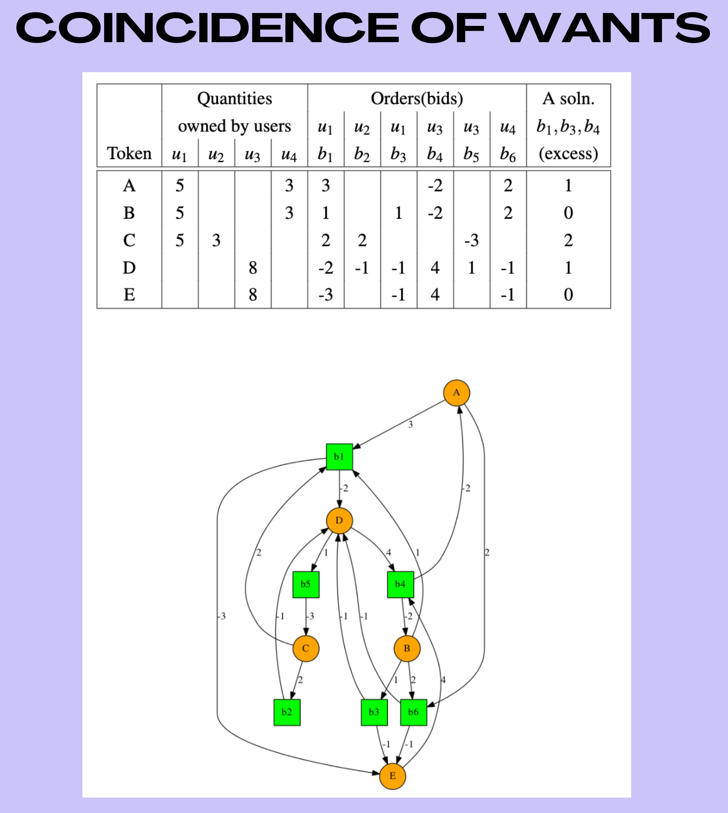

## Protocol for Management and Bartering of Game (NFT) Assets

 

### I. Introduction

 

Following [Story's design principles](https://docsend.com/view/g5wcqbm9a3se446t), we utilize [Simplicity First](http://principles-wiki.net/principles:gall_s_law), [Composability](https://a16zcrypto.com/posts/article/composability-is-to-software-as-compounding-interest-is-to-finance/), and Extensibility to design a plan to implement an end-to-end (first version of a) marketplace protocol for managing game NFT assets.

 

 
 

Our protocol is designed to take advantage of non-fungible tokens (*i.e.*, EVM’s compatible standards such as [ERC-721](https://ethereum.org/en/developers/docs/standards/tokens/erc-721), [ERC-1155](https://ethereum.org/en/developers/docs/standards/tokens/erc-1155), and extensions) for game assets, which includes **ownership** (the address that holds the token), provable [scarcity](https://vitalik.eth.limo/general/2021/03/23/legitimacy.html) (through rarity traits and authenticity), [interoperability](https://www.playtoearn.online/whats-interoperability/), and **emitting events** when the state changes.

Storage and computation costs are expensive and restricted on the Ethereum blockchain. To overcome the challenges regarding **searching, sorting, notification**, and **bartering**, our **hybrid design contains both on-chain and off-chain components**. 
 
In addition, the [blockchain trilemma](https://vitalik.eth.limo/general/2021/04/07/sharding.html) states that only two can be guaranteed among: decentralization, security, and scalability (similarly to the broader [CAP theorem](https://en.wikipedia.org/wiki/CAP_theorem)). Since Ethereum communities emphasize that [decentralization](https://onezero.medium.com/why-decentralization-matters-5e3f79f7638e) and security are prerogatives, we design a solution that improves scalability through an **off-chain microservice infrastructure** (which can be deployed in a cloud service such as [AWS](https://aws.amazon.com/), [GCP](https://cloud.google.com/?hl=en), [Azure](https://azure.microsoft.com/en-us/), [Vercel](https://vercel.com/), etc.).

While these choices might initially compromise certain aspects of decentralization of the protocol, our **modular design** allows for gradual improvements and [progressive decentralization](https://a16zcrypto.com/posts/article/progressive-decentralization-crypto-product-management/) in future versions that could take full advantage of blockchain technologies, for instance, by exploring layer-2 strategies.

In the subsequent sessions, we discuss the design and roadmap for our protocol, concluding with a survey on improvements, roads not taken, and their merits and demerits.

 

----

 

### II. Assumptions

 

We make the following assumptions in our design:

 

* The **game's assets smart contracts are already available in another protocol and platform**, which we have access to through the blockchain APIs.

 

* The player already has a **digital wallet on which the assets are minted to**. The assets are not [soulbound](https://vitalik.ca/general/2022/01/26/soulbound.html), *i.e.,* they can be transferable.

 

* The game's assets smart contracts contain (immutable) **metadata that indicates an asset's rarity and utility** (*e.g.,* name, category, permanent URL for thumbnail, traits, required level). 
    - Our protocol will use this data to calculate a "rating" for the asset, which facilitates bartering (illustrated in the frontend sketch as a 1-5 stars rating).
    - The algorithm calculating this rating is out of the scope of this document, but we incorporated it into our modular microservice infrastructure.

 

* Although this is a high-level design and we won't explicitly specify our protocol's smart contracts, they should contain **two mutable `boolean` variables** (or a logic variation):
    - `EQUIPPED`: specifying that the player's avatar is wearing the asset. This variable should be in sync with the game's main protocol.
    - `FOR_TRADE`: specifying that the player has marked the asset for bartering. 
    
 

* As our protocol only focuses on bartering, the original asset's smart contracts have **no logic for secondary market fee**s (or are irrelevant in our context).

 

* Our protocol's smart contracts contain **logic for a marketplace's fee in each barter transaction**, and this is the only fee we consider in this design.

 

----

 

### III. Protocol Layers

 
 

 
 

The **frontend layer** should provide the functions sketched in Figure 1, consisting of a simple dashboard that can be built on a **JavaScript/TypeScript framework**:

* The only extra complexity is the **integration with browser wallets**. 

* **Signning up or logging in should leverage the game's original protocol** or simply be **achieved through the user's wallet**, as we are not creating a separate profile database or gathering personal data for the user.

 

The **backend layer** consists of:

* A **database solution to track bartering operations** (*e.g.*, a NoSQL such as [MongoDB](https://www.mongodb.com/) or an RDBMS supporting big data). 
    - In the simplest form, every time a user places a bartering bid on an asset, the database could create an entry with the asset's and the user's `address` (or `tokenId`). This entry would be deleted when the bid is refused or accepted.
    - This approach could be later replaced by decentralized alternatives (*e.g.,* [kwil](https://www.kwil.com/), [orbitDB](https://orbitdb.org/), [bigchainDB](https://www.bigchaindb.com/), [convenantSQL](https://developers.covenantsql.io/docs/en/intro), [ceramic](https://ceramic.network/)).

* An **orchestration infrastructure**, through a [Kubernetes](https://kubernetes.io/) solution written on [Terraform](https://www.terraform.io/).

* **Microservices** for off-chain **searching and sorting** (*e.g.*, [ELK](https://aws.amazon.com/what-is/elk-stack/), [BigQuery](https://cloud.google.com/bigquery/), [CloudSearch](https://aws.amazon.com/cloudsearch/), [Hive](https://hive.apache.org/)), **notification system** (*e.g.*, a simple cloud messaging service such as [AWS SNS](https://aws.amazon.com/sns/) or a more elaborated pub/sub solution such as [AWS SQS](https://aws.amazon.com/sqs/), [Kafka](https://kafka.apache.org/), [ZeroMQ](https://zeromq.org/), [AWS Kinesis](https://aws.amazon.com/kinesis/), [RabbitMQ](https://rabbitmq.com/)), and an **asset rating evaluation** (through an in-house algorithm leveraging the assets' traits as input).

* A **CI/CD pipeline** (*e.g.*, [Jenkins](https://www.jenkins.io/), [CircleCI](https://circleci.com/), [GitHub Actions](https://github.com/features/actions)).

* Depending on the scale of the project, we might want to rely on something other than [blockchain data availability](https://ethereum.org/en/developers/docs/data-availability), so we could consider adding a **database to cache the smart contract events and keep track of ownership** (*e.g.*, [Redis](https://redis.io/)). This extra step is included in the roadmap below.

 * Likewise, any gateway and CDN solution should be incorporated in this layer.
    
 

Finally, the **blockchain layer** contains our protocol smart contracts and their test suites. A multi-signature wallet (*e.g.,* [Gnosis](https://www.gnosis.io/)) could be leveraged to enhance the security of this deployment.

 

 
 

----

 

### IV. Implementation Roadmap

 
 

 
 

----

 

### V. Roads Not Taken in Our Approach

 

#### A Full On-Chain Marketplace for Auctions with a Native Token

 

Ideally, a marketplace should use smart contracts to fully control asset auctions and transactions. Examples of this approach are [Sandbox](https://www.sandbox.game/en/) or [Axie Infinite Marketplace's contract for auction](https://etherscan.io/address/0xf4985070ce32b6b1994329df787d1acc9a2dd9).

However, since we are only focusing on bartering, this solution is overkill as creating a new token brings several challenges, such as extra engineering resources, adoption, tokenomics design, and security concerns. 

 

#### A Full On-Chain Decentralized Autonomous Bartering Algorithm

 

In general, finding [multiple "coincidence of wants"](https://www.geeksforgeeks.org/what-is-barter-system-and-double-coincidence-of-wants/) of various assets translates to finding hypercycles in directed hypergraphs (an [NP-complete](https://en.wikipedia.org/wiki/NP-completeness) problem). Therefore, the bartering problem in a distributed setting is similar to [Dijkstra’s Banker’s Problem](https://en.wikipedia.org/wiki/Banker's_algorithm).

 

 
 

An on-chain implementation of this algorithm is tricky. In its most naive form, the design could be costly and probably prone to tampering, fraud, and MEV exploitation. In addition, it would need to assume a large amount of simultaneous trades.

 

#### A Coincidence-of-Wants Bartering Algorithm with Off-Chain Batches

Instead of leveraging an off-chain database solution, we could move our bartering logic on-chain by implementing a system for "coincidence of wants" with batch transfers. 

In this approach, when multiple [intents](https://www.paradigm.xyz/2023/06/intents) for the same asset are within a batch, there could be an opportunity for a peer-to-peer swap that doesn't rely on the main network.

A successful example in DeFi is the [CowSwap](https://cow.fi/) protocol, which collects and aggregates intents off-chain, setting them on batches. The batches are run by third-party solvers.

This design would need to assume a large number of trades at the same time and that there will be willed solvers (or an extra in-house structure) to run the batches.

 

#### An NFT-focused Chain or L2

A few successful decentralized game platforms (such as [Enjin](https://enjin.io/) and [Immutable X](https://www.immutable.com/)) have adopted an NFT-focused chain or L2 solution to customize the process of multiple NFT transfers, tracking metadata and provenance, facilitating intellectual property, and interoperability among chains. 

However, there is a massive overhead to building, maintaining, governing, and creating the adoption of a new blockchain and a native token, making this solution unsuitable for our bartering protocol.
